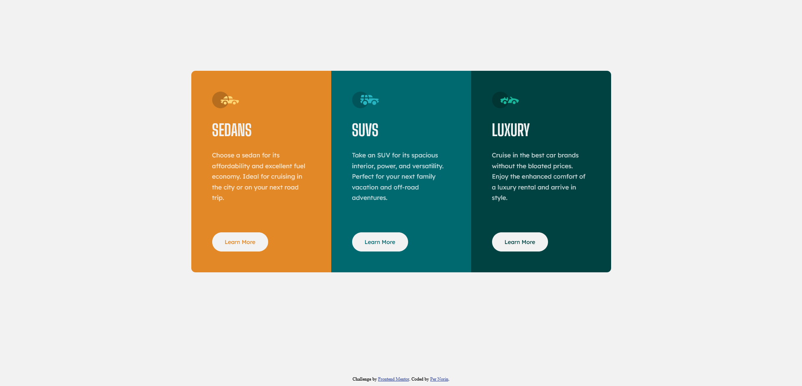

# Frontend Mentor - 3-column preview card component solution

This is a solution to the [3-column preview card component challenge on Frontend Mentor](https://www.frontendmentor.io/challenges/3column-preview-card-component-pH92eAR2-). Frontend Mentor challenges help you improve your coding skills by building realistic projects.

## Table of contents

- [Overview](#overview)
  - [The challenge](#the-challenge)
  - [Screenshot](#screenshot)
  - [Links](#links)
- [My process](#my-process)
  - [Built with](#built-with)
  - [My first Frontend Mentor challenge](#My-first-Frontend-Mentor-challenge)
- [Author](#author)

## Overview

### The challenge

Users should be able to:

- View the optimal layout depending on their device's screen size
- See hover states for interactive elements

### Screenshot

### Links

- [My solution](https://pernorin.github.io/3-column-preview-card-component/)

## My process

### Built with

- HTML5 markup
- CSS
- Flexbox
- Mobile-first workflow

### My first Frontend Mentor challenge

I started with an easy project to try Frontend Mentor out. Next time I'll do something more difficult.

## Author

- Per Norin
- Frontend Mentor - [@pernorin](https://www.frontendmentor.io/profile/pernorin)
